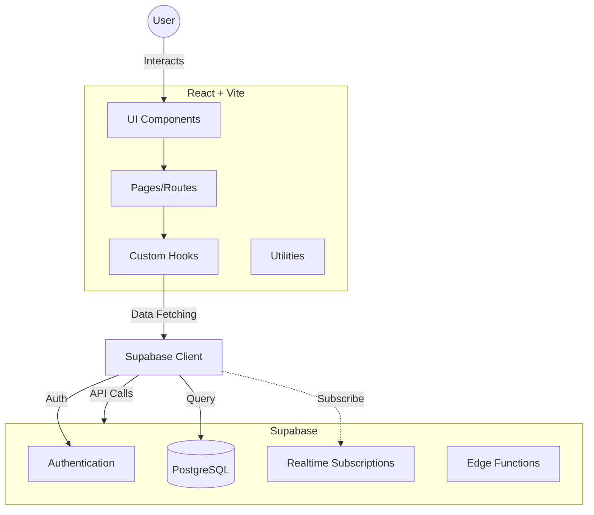

# 🐷 Nenita Farm Lechon Haus - Restaurant Management System


A comprehensive, all-in-one Restaurant Management System (RMS) tailored for **Nenita Farm Lechon Haus and Catering Services**. This application streamlines operations from order taking to financial reporting, ensuring data accuracy and operational efficiency.

## 🚀 Features

## 🛠️ Recent Improvements

- **Offline Sync Fix**: Prevents duplicate order entries on reconnection by using a `useRef` lock in `hooks/useOfflineSync.ts`.
- **False Offline Mode Prevention**: `saveOrderWithOfflineSupport` now distinguishes network errors from other errors, avoiding accidental offline saves.
- **Delete Persistence**: Added RLS `DELETE` policies for `orders` and `order_items` in Supabase (`supabase/fix_delete_policy.sql`).

## 🏗️ Architecture



## ⚠️ SECURITY NOTICE

**IMPORTANT**: Before running this application, please read [SECURITY_NOTICE.md](SECURITY_NOTICE.md) for critical security information.

## 🚀 Features

### 🛒 Point of Sale (POS)

- **Visual Menu:** Grid-based menu browsing with categories (Lechon, Pork, Chicken, etc.).
- **Smart Cart:** Handles weighted items (e.g., Lechon by kg) and variants (e.g., Party Trays).
- **Order Types:** Support for Dine-in, Takeout, and Delivery.
- **Discounts:** Automated calculation for Senior Citizen and PWD discounts.

### 📊 Dashboard & Analytics

- **Real-time Metrics:** Live view of Total Sales, Order Count, and Net Cash on Hand.
- **Visualizations:** Interactive charts for daily and weekly sales trends.
- **Activity Feed:** Live stream of recent orders and system actions.

### 💰 Financial Management

- **Expense Tracking:** Record and categorize daily operational expenses.
- **Sales Adjustments:** Manual entry for non-POS revenue or corrections.
- **Reports:** Generate professional PDF reports for Daily Sales and Net Income.

### 👥 Staff & Operations

- **Staff Roster:** Manage active employees and roles.
- **Booking System:** Calendar view for catering reservations and pre-orders.

---

## 🛠️ Tech Stack

- **Frontend:** [React 19](https://react.dev/) + [Vite](https://vitejs.dev/)
- **Styling:** [Tailwind CSS](https://tailwindcss.com/) + [Lucide Icons](https://lucide.dev/)
- **Backend:** [Supabase](https://supabase.com/) (PostgreSQL, Auth, Realtime)
- **Charts:** [Recharts](https://recharts.org/)
- **Reporting:** [React-PDF](https://react-pdf.org/)
- **Testing:** [Vitest](https://vitest.dev/)

---

## 💻 Getting Started

### Prerequisites

- Node.js (v18 or higher)
- npm or yarn

### Installation

1.  **Clone the repository**

    ```bash
    git clone https://github.com/your-username/nenita-farm-lechon-pos.git
    cd nenita-farm-lechon-pos
    ```

2.  **Install dependencies**

    ```bash
    npm install
    ```

3.  **Environment Setup**
    Copy `.env.example` to `.env` and set your credentials:

    ```bash
    cp .env.example .env
    ```

    Edit `.env` with your Supabase URL and Anon Key.

    > **IMPORTANT**: Never share or commit your `.env` file.
    > On Unix/Linux systems, restrict file permissions: `chmod 600 .env`

4.  **Run the development server**
    ```bash
    npm run dev
    ```
    The app will be available at `http://localhost:3000`.

---

## 🚢 Deployment

### Staging (Azure Static Web Apps)

This project uses **Azure Static Web Apps** for staging.

- **Trigger:** Automatically deploys whenever a Pull Request is opened against `main`.
- **URL:** The staging URL is provided by the Azure bot in the PR comments.

### Production (VPS)

Production deployment is handled via a custom shell script to a VPS (Nginx).

1.  **Build:** `npm run build`
2.  **Deploy:** Run the deployment script:
    ```bash
    ./deploy.sh
    ```
    _Note: Requires SSH access to the production server._

### Production Security Checklist

1. Use secure environment variable management (GitHub Secrets, etc.)
2. Never commit the `.env` file
3. Change default passwords in the database
4. Review and enable Row Level Security policies in Supabase

---

## 📂 Project Structure

/src
  ├── components/    # Reusable UI components
  ├── hooks/         # Custom React hooks (Data access, State)
  ├── services/      # API Service Layer (Supabase, Business Logic)
  ├── utils/         # Pure utility functions (Formatting, Exports)
  ├── lib/           # Supabase Client configuration
  ├── pages/         # Page components (if using router)
  ├── constants.ts   # Static data
  ├── types.ts       # TypeScript interfaces
  └── App.tsx        # Main application entry

---

## 🧪 Testing

Run the test suite using Vitest:

```bash
npm run test
```
