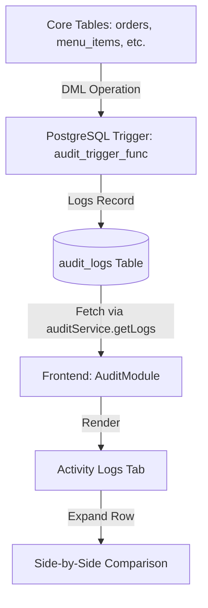
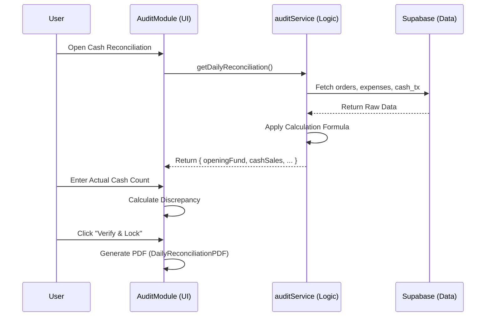

# Auditing System Technical Architecture

This document outlines the technical architecture, data flow, and implementation details of the auditing system in the Nenita Farm POS repository.

## Overview

The auditing system is composed of two primary subsystems designed to ensure financial integrity and operational transparency:

1.  **Activity Logs System**: Automatically tracks all database mutations (INSERT, UPDATE, DELETE) across core business tables.
2.  **Cash Reconciliation System**: A daily workflow for balancing physical cash drawer counts against system-calculated expectations.

---

## 1. Activity Logs Architecture

The Activity Logs system operates primarily at the database level using PostgreSQL triggers to ensure that no change goes unrecorded, regardless of whether it originated from the frontend or a direct database operation.

### Data Flow: Database to Frontend

### Technical Implementation

-   **Database Triggers**: Defined in [20260108_auditing_system.sql](file:///Users/gabz_1/Downloads/nenita-farm-lechon-pos/supabase/migrations/20260108_auditing_system.sql). The `audit_trigger_func` captures the `OLD` and `NEW` states of a record as JSONB.
-   **Audit Schema**: The `audit_logs` table stores:
    -   `table_name`: The source table.
    -   `action`: INSERT, UPDATE, or DELETE.
    -   `old_data` / `new_data`: JSONB snapshots of the record.
    -   `changed_by`: UUID of the user (extracted from `created_by`/`updated_by` columns or Supabase Auth context).
-   **Soft Deletes**: The system uses a `deleted_at` timestamp for orders instead of physical deletion, providing an extra layer of auditability.

---

## 2. Cash Reconciliation Architecture

The Cash Reconciliation system calculates how much cash *should* be in the drawer by aggregating data from multiple transaction sources.

### Calculation Logic

The "System Expected Cash" is calculated using the following formula:

**`Expected Cash = Opening Fund + Cash Sales - (Expenses + Cash Drops)`**

### Data Sources & Flow

| Component | Data Source | logic / Filtering |
| :--- | :--- | :--- |
| **Opening Fund** | `cash_transactions` | Type: `OPENING_FUND` (Filtered for today) |
| **Cash Sales** | `orders` | Payment Method: `CASH` (Filtered for today) |
| **Expenses** | `expenses` | All recorded expenses (Filtered for today) |
| **Cash Drops** | `cash_transactions` | Type: `CASH_DROP` (Filtered for today) |

### Report Generation

-   **Component**: [DailyReconciliationPDF.tsx](file:///Users/gabz_1/Downloads/nenita-farm-lechon-pos/src/components/DailyReconciliationPDF.tsx)
-   **Trigger**: The "Verify & Lock Daily Report" button in [AuditModule.tsx](file:///Users/gabz_1/Downloads/nenita-farm-lechon-pos/src/components/AuditModule.tsx).
-   **Output**: A PDF document including reconciliation totals, discrepancy status, auditor signature sections, and a unique Report ID.

---

## 3. Component Relationships

The auditing system interacts with various parts of the codebase to aggregate data accurately.

-   **`AuditModule.tsx`**: The main entry point. Orchestrates the UI tabs and handles the PDF generation state.
-   **`auditService.ts`**: The central logic hub. Fetches logs and performs the multi-service data aggregation for reconciliation.
-   **`orderService.ts` / `financeService.ts`**: Provide the raw transaction data consumed by the audit service.
-   **`DailyReconciliationPDF.tsx`**: A pure functional component using `@react-pdf/renderer` to format the final audit document.

---

## 4. Key Security & Integrity Features

-   **Row Level Security (RLS)**: Enabled on `audit_logs` to ensure only authorized staff can view the audit trail.
-   **Discrepancy Highlighting**: The UI automatically flags discrepancies > ₱1.00 in red to alert auditors of potential issues.
-   **Un-editable Logs**: Audit logs are designed to be append-only; there is no logic in the application to update or delete rows from the `audit_logs` table.
