# Auditing System Guide & User Flow

The Auditing System is designed to provide complete transparency and accountability for all operations within the Nenita Farm Lechon POS. It tracks every change made to sensitive data, manages "soft deletes" for orders, and facilitates daily cash reconciliation.

## 🔄 System Architecture Diagram

---

## 🚀 User Flow: Activity Monitoring

### 1. Accessing the Audit Trail
- Click on the **Audit** icon in the main sidebar.
- You will arrive at the **System Audit Trail** dashboard.

### 2. Reviewing Activity Logs
- The **Logs Table** displays the most recent system events first.
- **Columns**: Time, User (Staff Member), Table (Component), Action (INSERT/UPDATE/DELETE), and Record ID.
- **Filtering**: Use the search bar to filter by staff name, specific tables (e.g., `orders`, `inventory`), or actions.

### 3. Deep Dive into Data Changes
- Click on any log entry row to expand the **State Comparison**.
- **Previous State**: Shows what the data looked like before the change.
- **New State**: Shows the current values after the modification.
- *Tip: This is critical for investigating why an order total changed or which item was adjusted.*

---

## 💰 User Flow: Daily Cash Reconciliation

```mermaid
sequenceDiagram
    participant M as Manager
    participant S as Audit Service
    participant DB as Supabase DB

    Note over M, DB: Daily Reconciliation Process
    M->>S: Open Reconciliation Tab
    S->>DB: Fetch Sales, Expenses, Drops
    DB-->>S: Raw Transaction Data
    S->>S: Calculate Expected Cash
    S-->>M: Display "Expected: ₱X,XXX"
    M->>M: Physical Cash Count
    M->>M: Input "Actual Cash"
    alt Discrepancy Found
        M->>S: Investigate Logs
    else Matches
        M->>M: All clear
    end
    M->>S: Click "Verify & Lock"
```

This flow ensures that the cash in your drawer matches the system's recorded sales.

1.  Navigate to the **Audit** page.
2.  Select the **Cash Reconciliation** tab.
3.  **Review Expected Cash**: The system automatically calculates:
    *   `Opening Fund` + `Cash Sales` - `Expenses` - `Cash Drops`.
4.  **Enter Actual Cash**: Physically count the cash in the drawer and type it into the **Cash in Drawer** field.
5.  **Identify Discrepancies**:
    *   **Green**: Matches perfectly.
    *   **Red**: Indicates a discrepancy (overage or shortage).
6.  **Verify & Lock**: Once the discrepancy is explained or resolved, the manager clicks **Verify & Lock Daily Report** to finalize the day.

---

## 🛡️ Technical Implementation Details (For Developers)

### 1. Database-Level Triggers (Supabase)
The auditing does not happen in the frontend. It is powered by **SQL Triggers** in the `supabase/migrations/20260108_auditing_system.sql`.
- Every sensitive table is attached to an `audit_trigger`.
- Logs are stored in a dedicated `audit_logs` table.
- This ensures that even if someone modifies the DB directly, the action is still recorded.

### 2. "Soft Deletes" for Orders
Orders are never truly "erased". When a user deletes an order:
- The system sets a `deleted_at` timestamp.
- The `orderService.ts` filters these out from active sales.
- The `AuditModule` still records the `DELETE` action, allowing managers to see who "deleted" a sale and why.

### 3. Automated Reconciliation Service
- **Service**: `auditService.ts`
- **Method**: `getDailyReconciliation()`
- This refactored service centralizes the math for expected cash, making it testable and consistent across the app.

---

## 📋 Audit Stats Summary
The top bar of the Audit module provides a quick health check:
- **Total Events**: Volume of activity.
- **Inserts**: New records created.
- **Updates**: Modifications to existing data.
- **Deletions**: Data removals (Audited).

> [!IMPORTANT]
> A discrepancy of more than ₱50.00 in the Cash Reconciliation should trigger an immediate review of the **Activity Logs** for that specific day.
